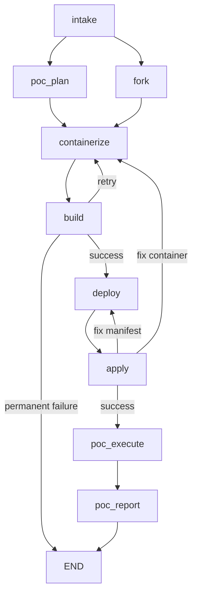

# AutoPoC

**Automated proof-of-concept deployments on OpenShift AI / Open Data Hub.**

Given a GitHub repository URL, AutoPoC analyzes the project, generates a PoC plan, containerizes it with UBI-based images, deploys to Kubernetes, runs test scenarios, and produces a report -- all without human intervention.

Built with [LangGraph](https://github.com/langchain-ai/langgraph) and [Claude](https://www.anthropic.com/claude).

## How It Works

```bash
autopoc run --name mempalace --repo https://github.com/MemPalace/mempalace
```

AutoPoC runs a pipeline of 9 specialized agents. Some are procedural (no LLM), some use a single LLM call, and some are full ReAct agents with tools:

```
intake --> [poc_plan || fork] --> containerize <-> build --> deploy <-> apply --> poc_execute --> poc_report
```

| Agent | Type | What it does |
|-------|------|-------------|
| **Intake** | Procedural + one-shot LLM | Clones the repo, builds a structural digest, identifies components (languages, ports, build systems, ML workloads) |
| **PoC Plan** | One-shot + ReAct fallback | Classifies the project (model-serving, RAG, web-app, etc.), identifies infrastructure needs, defines test scenarios, writes `poc-plan.md` |
| **Fork** | Procedural (no LLM) | Creates a project on self-hosted GitLab, pushes all branches and tags. Runs in parallel with PoC Plan |
| **Containerize** | ReAct agent | Generates `Dockerfile.ubi` files using Red Hat Universal Base Images. Handles Python, Node.js, Go, Java, multi-stage builds |
| **Build** | Procedural + LLM diagnosis | Builds images with Podman, pushes to Quay. On failure, uses the LLM to diagnose build logs |
| **Deploy** | ReAct agent | Generates Kubernetes manifests (Deployments, Services, Jobs, PVCs, Secrets). Does NOT apply them |
| **Apply** | ReAct agent | Applies manifests via kubectl, waits for rollouts, verifies pods, extracts service URLs |
| **PoC Execute** | ReAct agent | Runs the test scenarios from the PoC plan against the deployed application |
| **PoC Report** | One-shot (no tools) | Generates a markdown report with pass/fail results, logs, and recommendations |

### Retry loops

The pipeline is not linear -- it has feedback loops:

- **Build failure** routes back to **Containerize** to fix the Dockerfile, then retries the build (up to 3 attempts).
- **Apply failure** routes back to **Deploy** to fix manifests (up to 2 attempts), or escalates to **Containerize** if the container itself is the problem (up to 2 attempts).

## Quickstart

### Prerequisites

- Python 3.12+
- [Podman](https://podman.io/) for building container images
- Access to a GitLab instance, Quay registry, and Kubernetes/OpenShift cluster
- An Anthropic API key or Google Cloud Vertex AI project with Claude access

### Install

```bash
git clone https://github.com/aicatalyst-team/autopoc.git
cd autopoc
pip install -e .

# Optional: SQLite checkpointing for resume support
pip install -e ".[checkpoint]"
```

### Configure

```bash
cp .env.example .env
# Edit .env with your credentials
```

| Variable | Required | Description |
|----------|----------|-------------|
| `ANTHROPIC_API_KEY` | Yes* | Anthropic API key |
| `VERTEX_PROJECT` | Yes* | Google Cloud project ID (alternative to Anthropic key) |
| `VERTEX_LOCATION` | No | Vertex AI region (default: `us-east5`) |
| `LLM_MODEL` | No | Model override (default: `claude-3-5-sonnet-20241022`) |
| `GITLAB_URL` | Yes | Self-hosted GitLab URL |
| `GITLAB_TOKEN` | Yes | GitLab personal access token (api + read/write_repository scopes) |
| `GITLAB_GROUP` | Yes | GitLab group for forked repos (e.g. `poc-demos`) |
| `QUAY_REGISTRY` | Yes | Container registry URL (e.g. `quay.io` or `http://localhost:8080`) |
| `QUAY_ORG` | Yes | Registry organization/namespace |
| `QUAY_TOKEN` | Yes | Registry OAuth token |
| `OPENSHIFT_API_URL` | Yes | Kubernetes/OpenShift API server URL |
| `OPENSHIFT_TOKEN` | Yes | Kubernetes auth token |
| `OPENSHIFT_NAMESPACE_PREFIX` | No | Namespace prefix (default: `poc`) |
| `MAX_BUILD_RETRIES` | No | Build retry limit (default: `3`) |
| `MAX_DEPLOY_RETRIES` | No | Deploy/apply retry limit (default: `2`) |
| `MAX_CONTAINER_FIX_RETRIES` | No | Container fix escalation limit (default: `2`) |
| `WORK_DIR` | No | Local working directory (default: `/tmp/autopoc`) |

*One of `ANTHROPIC_API_KEY` or `VERTEX_PROJECT` is required.

### Run

```bash
# Run the full pipeline
autopoc run --name my-project --repo https://github.com/org/repo

# Verbose output (shows LLM calls, tool usage, timing)
autopoc run --name my-project --repo https://github.com/org/repo --verbose

# Skip credential validation at startup
autopoc run --name my-project --repo https://github.com/org/repo --skip-validation

# Override the LLM model
autopoc run --name my-project --repo https://github.com/org/repo --model claude-3-5-haiku@20241022
```

## CLI Reference

```
autopoc run       --name NAME --repo URL [--verbose] [--skip-validation] [--model MODEL]
autopoc resume    --thread-id ID [--verbose]
autopoc status    --thread-id ID
autopoc graph     [--format mermaid|ascii]
```

| Command | Description |
|---------|-------------|
| `run` | Run the full pipeline. Prints a thread ID for resume/status. |
| `resume` | Resume an interrupted pipeline from its last checkpoint. Requires `pip install -e ".[checkpoint]"`. |
| `status` | Show the current state of a pipeline run (phase, components, images, routes, errors). |
| `graph` | Print the pipeline graph structure in Mermaid or ASCII format. |

## Architecture



Design decisions:

- **Parallel fan-out**: `poc_plan` and `fork` run concurrently after intake -- the plan doesn't depend on the GitLab fork, and both can take 30+ seconds.
- **Retry with escalation**: Apply failures first try fixing manifests (deploy retry). If that doesn't work, the pipeline escalates to fixing the container image (containerize retry).
- **Separation of concerns**: `containerize` generates Dockerfiles, `build` runs Podman. `deploy` generates manifests, `apply` runs kubectl. Each agent has a focused tool set and can be debugged independently.
- **Procedural pre-processing**: Intake builds a deterministic repo digest (~10KB text summary) without any LLM calls. This digest feeds into all downstream agents, ensuring consistent context.
- **Context management**: ReAct agents have a `pre_model_hook` that compacts conversation history when it approaches 120K estimated tokens. Older tool results are truncated to summaries, preserving the most recent context.

See [`docs/architecture.md`](docs/architecture.md) for detailed agent-by-agent documentation.

## Project Structure

```
src/autopoc/
  agents/             # Agent implementations (one per pipeline node)
    intake.py         #   Repo analysis (procedural digest + one-shot LLM)
    poc_plan.py       #   PoC planning (one-shot + ReAct fallback)
    fork.py           #   GitLab fork (procedural, no LLM)
    containerize.py   #   Dockerfile generation (ReAct)
    build.py          #   Podman build + push (procedural + LLM diagnosis)
    deploy.py         #   K8s manifest generation (ReAct)
    apply.py          #   kubectl apply + verify (ReAct)
    poc_execute.py    #   Test scenario execution (ReAct)
    poc_report.py     #   Report generation (one-shot, no tools)
  tools/              # LangChain tools for agents
    repo_digest.py    #   Procedural repo summarizer (no LLM)
    file_tools.py     #   read_file, write_file, list_files, search_files
    git_tools.py      #   git clone, commit, push, branch
    gitlab_tools.py   #   GitLab API client
    podman_tools.py   #   podman build, push, login
    quay_tools.py     #   Quay registry API client
    k8s_tools.py      #   kubectl apply, get, logs, wait
    script_tools.py   #   Python script execution
    template_tools.py #   Jinja2 template rendering
  prompts/            # System prompts for each agent (markdown)
  templates/          # Jinja2 templates (Dockerfile.ubi, deployment.yaml, etc.)
  graph.py            # LangGraph pipeline definition
  state.py            # PoCState TypedDict (shared state schema)
  config.py           # Pydantic Settings configuration
  context.py          # Token budget management for ReAct agents
  cli.py              # Typer CLI application
  credentials.py      # Startup credential validation
  llm.py              # LLM provider factory (Anthropic / Vertex AI)
  logging_config.py   # Rich logging setup
scripts/
  setup-e2e.sh            # Provision E2E infrastructure (GitLab + Quay)
  teardown-e2e.sh         # Tear down E2E infrastructure
  setup-local-k8s.sh      # Create local kind/k3d cluster
  teardown-local-k8s.sh   # Delete local cluster
  cleanup-project.sh      # Delete a single project's resources across all systems
  renew-quay-token.sh     # Regenerate Quay OAuth token
```

## Local E2E Testing

AutoPoC includes scripts for spinning up a complete local environment with GitLab, Quay, and Kubernetes -- no external services required.

### Setup

```bash
# 1. Start GitLab CE + Project Quay (takes 3-5 minutes for GitLab to initialize)
./scripts/setup-e2e.sh

# 2. Start a local Kubernetes cluster (kind or k3d)
./scripts/setup-local-k8s.sh

# Credentials are auto-written to .env.test
# AutoPoC uses .env.test automatically when it exists
```

### Run

```bash
# Run against a real repo using local infrastructure
autopoc run --name test-app --repo https://github.com/some/repo

# Run the E2E test suite
pip install -e ".[dev]"
pytest tests/e2e/ --e2e -v
```

### Cleanup

```bash
# Remove a single project's resources (GitLab project, Quay images, K8s namespace, work dir)
./scripts/cleanup-project.sh my-project

# Preview what would be deleted
./scripts/cleanup-project.sh my-project --dry-run

# Tear down all infrastructure
./scripts/teardown-local-k8s.sh
./scripts/teardown-e2e.sh
```

### What gets provisioned

| Service | URL | Purpose |
|---------|-----|---------|
| GitLab CE | `http://localhost:8929` | Git hosting, stores forked repos and generated Dockerfiles/manifests |
| Project Quay | `http://localhost:8080` | Container image registry |
| kind/k3d | `https://localhost:6443` | Local Kubernetes cluster for deployment testing |

## Debugging

### LangSmith tracing

Set these environment variables to trace all LLM calls and tool invocations:

```bash
LANGCHAIN_TRACING_V2=true
LANGCHAIN_API_KEY=ls__...
LANGCHAIN_PROJECT=autopoc
```

### LangGraph Studio

A `langgraph.json` config is included for [LangGraph Studio](https://github.com/langchain-ai/langgraph-studio). Open the project directory in Studio to visualize and step through pipeline runs.

### Verbose mode

```bash
autopoc run --name test --repo https://github.com/... --verbose
```

Shows INFO-level logs with timestamps, agent phases, tool calls, and context compaction events.

## Development

```bash
# Install with dev dependencies
pip install -e ".[dev]"

# Run unit tests
pytest tests/ --ignore=tests/e2e

# Lint
ruff check src/ tests/

# View the pipeline graph
autopoc graph --format mermaid
```

## License

[MIT](LICENSE)
