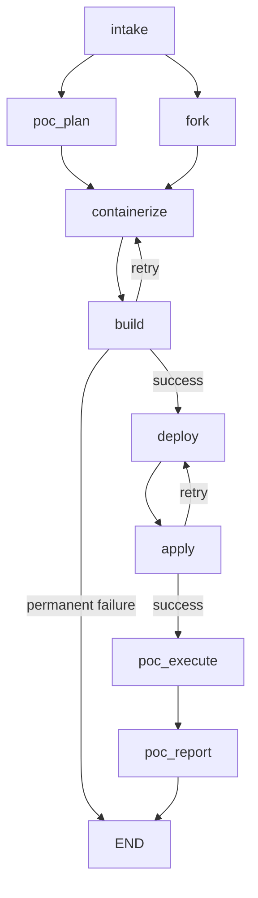

# AutoPoC

A multi-agent system that automates proof-of-concept deployments on OpenShift AI / Open Data Hub. Given a GitHub repository URL, AutoPoC analyzes the project, generates a PoC plan, containerizes it with UBI-based images, deploys to Kubernetes, runs test scenarios, and produces a report.

Built with [LangGraph](https://github.com/langchain-ai/langgraph) and Claude.

## What It Does

```
autopoc run --name mempalace --repo https://github.com/MemPalace/mempalace
```

AutoPoC runs a pipeline of specialized agents:

```
intake -> [poc_plan || fork] -> containerize <-> build -> deploy -> apply <-> poc_execute -> poc_report
```

1. **Intake** -- Clones the repo and produces a structured analysis (languages, build systems, components, ports, ML workloads). Uses a procedural repo digest + one-shot LLM call.

2. **PoC Plan** -- Determines what constitutes a meaningful proof of concept. Classifies the project (model-serving, RAG, training, web-app, llm-app), identifies infrastructure needs (GPU, vector DB, PVC), and defines test scenarios.

3. **Fork** -- Pushes the repo to a self-hosted GitLab instance (runs in parallel with PoC Plan).

4. **Containerize** -- Generates `Dockerfile.ubi` files using Red Hat Universal Base Images. Handles Python, Node.js, Go, Java, and multi-stage builds.

5. **Build** -- Builds container images with Podman and pushes to a Quay registry. Includes LLM-assisted build error diagnosis and retry.

6. **Deploy** -- Generates Kubernetes manifests (Deployments, Services, Jobs, PVCs, namespace, RBAC). Understands deployment models: long-running servers, CLI tools, batch jobs.

7. **Apply** -- Applies manifests via kubectl, waits for rollouts, verifies pods, and extracts service URLs.

8. **PoC Execute** -- Runs the test scenarios defined in the PoC plan against the deployed application.

9. **PoC Report** -- Generates a markdown report summarizing results, including pass/fail status, logs, and recommendations.

## Quickstart

### Prerequisites

- Python 3.12+
- [Podman](https://podman.io/) (for building container images)
- Access to a GitLab instance, Quay registry, and Kubernetes/OpenShift cluster
- An Anthropic API key or Google Cloud Vertex AI project

### Install

```bash
git clone https://github.com/your-org/autopoc.git
cd autopoc
pip install -e .

# Optional: SQLite checkpointing for resume support
pip install -e ".[checkpoint]"
```

### Configure

```bash
cp .env.example .env
# Edit .env with your credentials
```

Required configuration:

| Variable | Description |
|----------|-------------|
| `ANTHROPIC_API_KEY` | Anthropic API key (or use `VERTEX_PROJECT` + `VERTEX_LOCATION` for Vertex AI) |
| `GITLAB_URL` | Self-hosted GitLab URL |
| `GITLAB_TOKEN` | GitLab personal access token |
| `GITLAB_GROUP` | GitLab group for forked repos |
| `QUAY_REGISTRY` | Container registry hostname |
| `QUAY_ORG` | Registry organization/namespace |
| `QUAY_TOKEN` | Registry auth token |
| `OPENSHIFT_API_URL` | Kubernetes/OpenShift API URL |
| `OPENSHIFT_TOKEN` | Kubernetes auth token |

### Run

```bash
source .env

# Run the full pipeline
autopoc run --name my-project --repo https://github.com/org/repo

# Verbose output (shows LLM calls, tool usage, timing)
autopoc run --name my-project --repo https://github.com/org/repo --verbose

# Skip credential validation
autopoc run --name my-project --repo https://github.com/org/repo --skip-validation

# Override the LLM model
autopoc run --name my-project --repo https://github.com/org/repo --model claude-3-5-haiku@20241022
```

## CLI Reference

```
autopoc run       --name NAME --repo URL [-v] [--skip-validation] [--model MODEL]
autopoc resume    --thread-id ID [-v]
autopoc status    --thread-id ID
autopoc graph     [--format mermaid|ascii]
```

- **`run`** -- Run the full pipeline. Prints a thread ID for resume/status.
- **`resume`** -- Resume an interrupted pipeline from its last checkpoint (requires `langgraph-checkpoint-sqlite`).
- **`status`** -- Show the current state of a pipeline run (phase, components, images, routes, errors).
- **`graph`** -- Print the pipeline graph structure in Mermaid or ASCII format.

## Pipeline Architecture



Key design decisions:

- **Parallel fan-out**: `poc_plan` and `fork` run concurrently after intake.
- **Retry loops**: Build failures route back to containerize (to fix the Dockerfile). Apply failures route back to deploy (to fix manifests).
- **Separation of concerns**: `containerize` generates Dockerfiles, `build` runs Podman. `deploy` generates manifests, `apply` runs kubectl. Each agent has a focused tool set.
- **Procedural pre-processing**: Intake uses a deterministic repo digest (no LLM) + one-shot LLM analysis. PoC Plan tries a one-shot approach first, falling back to a ReAct agent with file tools only when needed.
- **Context management**: Agents that use ReAct (containerize, deploy, apply) have a `pre_model_hook` that compacts tool results to prevent token overflow.

## Project Structure

```
src/autopoc/
  agents/           # Agent implementations (one per pipeline node)
    intake.py       # Repo analysis (procedural digest + one-shot LLM)
    poc_plan.py     # PoC planning (one-shot + ReAct fallback)
    fork.py         # GitLab fork
    containerize.py # Dockerfile generation (ReAct agent)
    build.py        # Podman build + push
    deploy.py       # K8s manifest generation (ReAct agent)
    apply.py        # kubectl apply + verify (ReAct agent)
    poc_execute.py  # Test scenario execution (ReAct agent)
    poc_report.py   # Report generation (ReAct agent)
  tools/            # LangChain tools for agents
    repo_digest.py  # Procedural repo summarizer
    file_tools.py   # read_file, write_file, list_files, search_files
    git_tools.py    # git_clone, git_commit, git_push
    gitlab_tools.py # GitLab API client
    podman_tools.py # podman_build, podman_push, podman_login
    quay_tools.py   # Quay registry API client
    k8s_tools.py    # kubectl_apply, kubectl_get, kubectl_logs, etc.
    script_tools.py # Script generation and execution
    template_tools.py # Jinja2 template rendering
  prompts/          # System prompts for each agent
  templates/        # Jinja2 templates (Dockerfile.ubi, deployment.yaml, etc.)
  graph.py          # LangGraph pipeline definition
  state.py          # PoCState TypedDict (shared state schema)
  config.py         # Configuration loading from env vars
  context.py        # Token budget management for ReAct agents
  cli.py            # Typer CLI application
  credentials.py    # Startup credential validation
  llm.py            # LLM provider factory
  logging_config.py # Rich logging setup
scripts/
  setup-e2e.sh      # Set up E2E test infrastructure (GitLab + Quay + K8s)
  teardown-e2e.sh   # Tear down E2E infrastructure
  setup-local-k8s.sh    # Set up local kind cluster
  teardown-local-k8s.sh # Tear down local kind cluster
```

## E2E Testing

AutoPoC includes scripts for setting up a full local E2E environment:

```bash
# Set up GitLab CE + Project Quay + kind cluster
./scripts/setup-e2e.sh

# Credentials are written to .env.test
source .env.test

# Run against a test repo
autopoc run --name test-app --repo https://github.com/some/repo

# Tear down
./scripts/teardown-e2e.sh
```

The E2E setup provisions:
- **GitLab CE** (Docker) with a PAT and `poc-demos` group
- **Project Quay** (Docker) with an OAuth token and org
- **kind cluster** (local K8s) for deployment testing

## Debugging

### LangSmith Tracing

Set these in your `.env` to trace LLM calls:

```bash
LANGCHAIN_TRACING_V2=true
LANGCHAIN_API_KEY=ls__...
LANGCHAIN_PROJECT=autopoc
```

### LangGraph Studio

A `langgraph.json` config is included for [LangGraph Studio](https://github.com/langchain-ai/langgraph-studio). Open the project directory in Studio to visualize and debug pipeline runs.

### Verbose Mode

```bash
autopoc run --name test --repo https://github.com/... --verbose
```

Shows INFO-level logs with timestamps, agent phases, tool calls, and context compaction events.

## Development

```bash
pip install -e ".[dev]"

# Run tests (excluding E2E)
pytest tests/ --ignore=tests/e2e

# Lint
ruff check src/ tests/

# View the pipeline graph
autopoc graph --format mermaid
```

## License

See [LICENSE](LICENSE).
