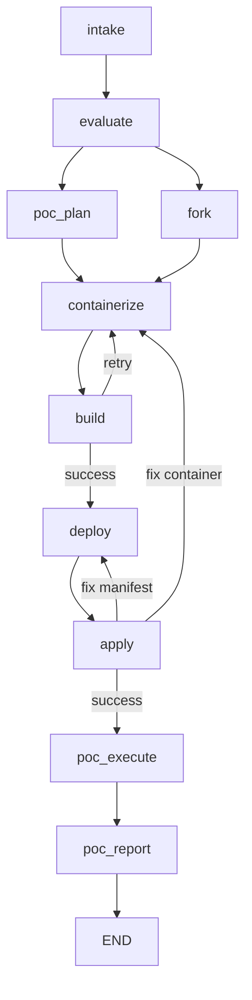

# AutoPoC

[](https://github.com/aicatalyst-team/autopoc/actions/workflows/ci.yml)

**Automated proof-of-concept deployments on OpenShift AI / Open Data Hub.**

Given a GitHub repo URL, AutoPoC analyzes the project, generates a PoC plan, containerizes it with UBI-based images, deploys to Kubernetes, runs test scenarios, and produces a report -- all without human intervention.

Built with [LangGraph](https://github.com/langchain-ai/langgraph) and [Claude](https://www.anthropic.com/claude).

## How It Works

```bash
autopoc run --name mempalace --repo https://github.com/MemPalace/mempalace
```

AutoPoC runs a pipeline of 10 specialized agents:

```
intake --> evaluate --> [poc_plan || fork] --> containerize <-> build --> deploy <-> apply --> poc_execute --> poc_report
```

| Agent | Type | What it does |
|-------|------|-------------|
| **Intake** | Procedural + LLM | Clones repo, builds structural digest, identifies components |
| **Evaluate** | One-shot LLM | Scores project fitness for OpenShift AI (non-blocking) |
| **PoC Plan** | One-shot + fallback | Classifies project, defines infrastructure needs and test scenarios |
| **Fork** | Procedural | Forks to GitHub or GitLab (parallel with PoC Plan) |
| **Containerize** | ReAct agent | Generates UBI-based Dockerfiles |
| **Build** | Procedural + LLM | Builds with Podman, pushes to Quay, diagnoses failures |
| **Deploy** | ReAct agent | Generates Kubernetes manifests |
| **Apply** | ReAct agent | Applies manifests, verifies pods, extracts routes |
| **PoC Execute** | ReAct agent | Runs test scenarios against deployed application |
| **PoC Report** | One-shot | Generates markdown report with results |

Build failures loop back to Containerize for Dockerfile fixes (up to 3 retries). Apply failures loop back to Deploy for manifest fixes (up to 2 retries).

## Quickstart

### Prerequisites

- Python 3.12+
- [Podman](https://podman.io/) for container builds
- Access to a Quay registry and Kubernetes/OpenShift cluster
- An LLM provider: Anthropic API key, Vertex AI project, or OpenAI-compatible endpoint

### Install

```bash
git clone https://github.com/aicatalyst-team/autopoc.git
cd autopoc
pip install -e ".[checkpoint]"
```

### Configure

```bash
cp .env.example .env
# Edit .env — see docs/configuration.md for all variables
```

At minimum, set one LLM provider (`ANTHROPIC_API_KEY`, `VERTEX_PROJECT`, or `LLM_BASE_URL`), registry credentials (`QUAY_*`), fork target credentials (`GITLAB_*` or `GITHUB_*`), and cluster access (`OPENSHIFT_*`).

### Run

```bash
# Single project
autopoc run --name my-project --repo https://github.com/org/repo

# Fork to GitHub instead of GitLab
autopoc run --name my-project --repo https://github.com/org/repo --target github

# From a Google Sheet of candidates
autopoc run-sheet --sheet-id 1ABCxyz... --credentials sa-key.json

# Resume an interrupted run
autopoc resume --thread-id my-project-a1b2c3d4
```

## CLI Reference

| Command | Description |
|---------|-------------|
| `autopoc run` | Run full pipeline for a single project |
| `autopoc run-sheet` | Read candidates from Google Sheet, evaluate, run top pick |
| `autopoc resume` | Resume from last checkpoint (requires `.[checkpoint]`) |
| `autopoc status` | Show current state of a pipeline run |
| `autopoc graph` | Print pipeline graph (mermaid or ASCII) |

## Architecture


```mermaid
graph TD;
    intake --> evaluate;
    evaluate --> poc_plan;
    evaluate --> fork;
    poc_plan --> containerize;
    fork --> containerize;
    containerize --> build;
    build -->|success| deploy;
    build -->|retry| containerize;
    deploy --> apply;
    apply -->|success| poc_execute;
    apply -->|fix manifest| deploy;
    apply -->|fix container| containerize;
    poc_execute --> poc_report;
    poc_report --> END;
```

Key design decisions are documented as [Architecture Decision Records](docs/adr/).

## Building

```bash
make build          # Single-file executable (dist/autopoc)
make install        # Editable install with dev deps
make test           # Unit tests with 80% coverage gate
make lint           # Lint with ruff
make typecheck      # Type-check with pyright
make fmt            # Auto-format
make image          # Container image
make lock           # Regenerate requirements.lock
```

## Debugging

- **LangSmith**: Set `LANGCHAIN_TRACING_V2=true` and `LANGCHAIN_API_KEY` for full LLM tracing
- **LangGraph Studio**: Open the project in [Studio](https://github.com/langchain-ai/langgraph-studio) (uses `langgraph.json`)
- **Verbose mode**: `autopoc run --verbose` for detailed logs

## Documentation

- [Configuration reference](docs/configuration.md) -- all environment variables
- [Architecture details](docs/architecture.md) -- agent-by-agent documentation
- [Architecture Decision Records](docs/adr/) -- why things are built this way
- [LLM proxy setup](docs/llm-proxy.md) -- OGX proxy for PoC projects
- [Local E2E testing](docs/e2e-testing.md) -- local GitLab + Quay + Kubernetes

## Development

```bash
make install        # Install with dev deps
make test           # Run tests (enforces 80% coverage)
make lint           # Lint
make typecheck      # Type-check
autopoc graph       # View pipeline graph
```

## License

[MIT](LICENSE)
