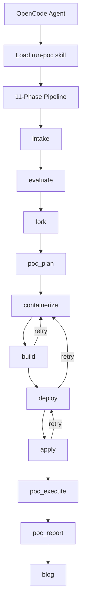

# AutoPoC

[](https://github.com/aicatalyst-team/autopoc/actions/workflows/ci.yml)

**Automated proof-of-concept deployments on OpenShift AI / Open Data Hub.**

Given a GitHub repo URL, AutoPoC analyzes the project, generates a PoC plan, containerizes it with UBI-based images, deploys to Kubernetes, runs test scenarios, and produces a report -- all without human intervention.

Built as an [OpenCode](https://opencode.ai) agent with specialized skills and powered by [Claude](https://www.anthropic.com/claude).

## How It Works

```bash
scripts/run-autopoc.sh myproject https://github.com/org/repo
```

AutoPoC runs as an OpenCode agent following a 11-phase skill-driven pipeline:

```
intake --> evaluate --> fork --> poc_plan --> containerize --> build --> deploy --> apply --> poc_execute --> poc_report --> blog
```

| Phase | What it does |
|-------|-------------|
| **Intake** | Clones repo, builds structural digest, identifies components |
| **Evaluate** | Scores project fitness for OpenShift AI using strategic evaluation |
| **Fork** | Forks to GitHub or GitLab for tracking |
| **PoC Plan** | Classifies project type, defines infrastructure needs and test scenarios |
| **Containerize** | Generates UBI-based Dockerfiles with proper build context |
| **Build** | Builds with Podman, pushes to Quay registry |
| **Deploy** | Generates Kubernetes manifests (Deployment, Service, Route) |
| **Apply** | Applies manifests, verifies pods, extracts accessible routes |
| **PoC Execute** | Runs test scenarios against the deployed application |
| **PoC Report** | Generates comprehensive markdown report with results |
| **Blog** | Creates a developer blog post about the PoC (optional) |

The agent uses progressive state tracking in YAML files and includes retry logic for build and deployment failures.

## Quickstart

### Prerequisites

- Access to a Kubernetes/OpenShift cluster for deployment
- [OpenCode](https://opencode.ai) installed and configured
- Container registry access (Quay.io recommended)
- GitHub/GitLab access for forking repositories
- Google Cloud Vertex AI or Anthropic API access for LLM

### Install

```bash
git clone https://github.com/aicatalyst-team/autopoc.git
cd autopoc
# Python tools are installed as part of the container image
```

### Configure

Set up the necessary environment variables for the deployment:

```bash
# Copy and edit the K8s secret template
cp deploy/secrets.yaml.example deploy/secrets.yaml
# Edit deploy/secrets.yaml with your credentials
```

Required configuration:
- **LLM**: Either `ANTHROPIC_API_KEY` or Vertex AI project settings
- **Registry**: `QUAY_ORG`, `QUAY_TOKEN` for Quay.io
- **Forking**: `GITLAB_URL`, `GITLAB_TOKEN`, `GITLAB_GROUP` or GitHub credentials
- **Cluster**: OpenShift cluster access for deployments

### Run

```bash
# Single project PoC
scripts/run-autopoc.sh myproject https://github.com/org/repo

# Process candidates from Google Sheet
scripts/run-sheet.sh sheet-id-here path/to/service-account.json

# Check status of running PoC
kubectl get pods -l app=autopoc
kubectl logs -f pod/autopoc-myproject-xxxxx
```

## Available Skills

The AutoPoC OpenCode agent provides three specialized skills:

| Skill | Description |
|-------|-------------|
| **run-poc** | Complete 11-phase PoC pipeline for a single GitHub repository |
| **run-sheet** | Batch process PoC candidates from Google Sheets |
| **blog-create** | Generate developer blog posts from PoC results |

Each skill provides comprehensive instructions for OpenCode to follow, including error handling and retry logic.

## Architecture

AutoPoC is built as an OpenCode agent with skill-driven architecture:


```mermaid
graph TD;
    A[OpenCode Agent] --> B[Load run-poc skill];
    B --> C[11-Phase Pipeline];
    C --> D[intake];
    D --> E[evaluate];
    E --> F[fork];
    F --> G[poc_plan];
    G --> H[containerize];
    H --> I[build];
    I --> J[deploy];
    J --> K[apply];
    K --> L[poc_execute];
    L --> M[poc_report];
    M --> N[blog];
    
    I -->|retry| H;
    J -->|retry| H;
    K -->|retry| J;
```

**Key Architecture Principles:**
- **Single Agent**: OpenCode is the sole agent, following detailed skill instructions
- **Progressive State**: Each phase updates a YAML state file for tracking and recovery
- **Skill-Driven**: Complex logic encoded in skill instructions rather than code
- **Containerized Execution**: Runs in Kubernetes pods for scalability and isolation
- **Retry Logic**: Built-in error handling and retry mechanisms per phase

Key design decisions are documented as [Architecture Decision Records](docs/adr/).

## Development

```bash
make install        # Install Python tools in editable mode
make test           # Unit tests with coverage
make lint           # Lint with ruff
make typecheck      # Type-check with pyright
make fmt            # Auto-format
make image          # Build container image
make lock           # Regenerate requirements.lock
```

## Debugging

- **Pod logs**: `kubectl logs -f pod/autopoc-<project>-xxxxx` for real-time execution logs
- **State tracking**: Check `poc-state.yaml` in the working directory for current phase status
- **OpenCode tracing**: Set appropriate environment variables for LLM call tracing
- **Skill validation**: Run `pytest tests/test_skill_files.py` to validate skill structure

## Documentation

- [Configuration reference](docs/configuration.md) -- environment variables and secrets
- [Architecture details](docs/architecture.md) -- skill-based architecture
- [Architecture Decision Records](docs/adr/) -- design decisions and rationale
- [OpenCode skills](.opencode/skills/) -- detailed skill instructions and reference files
- [LLM proxy setup](docs/llm-proxy.md) -- OGX proxy for PoC projects
- [Local E2E testing](docs/e2e-testing.md) -- local testing setup

## License

[MIT](LICENSE)
